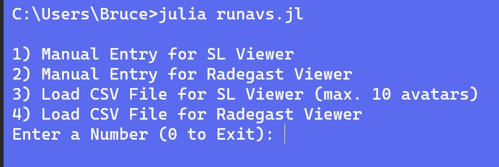

### 	Runavs : Julia script to launch avatars in Second Life

######     ***Currently this script only accepts one password for all avatars ***

To run this script:

- Set environment variable "SLP" to your one password 
- Install the Julia Language:   https://julialang.org/downloads/
- Run  the script in a terminal as follows:  *julia runavs.jl*  

The script also has a command-line switch if you need to delay the launch of your avatars.   It takes a 5 digit code for hour:minute based upon 24 hour clock of location.

Examples:

*julia runavs 11:33*

*julia runavs.jl 18:09*

*julia runavs.jl 09:55*

**Caution:   Do not exit the script until you are ready to logoff your avatars**

